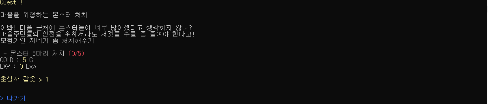

# 🕹️ 텍스트 RPG (C# 콘솔 게임)

내일배움캠프에서 진행한 과제인 간단한 **C# 콘솔 기반 RPG 게임**입니다.  

Program.cs가 메인 실행 스크립트입니다.

---
## 🛠️ 개발 환경

- 언어: **C#**
- 외부 라이브러리: 
  - **Spectre.Console (v0.5.0)** - 콘솔 UI 향상
  - **NAudio (v2.2.1)** - 배경 음악 및 효과음 재생

## 📁 프로젝트 구조

```
TextRpg/
├── Monster/                # 몬스터 관련 클래스
│   ├── Monster.cs         # 몬스터 기본 클래스
│   └── MonsterFactory.cs  # 몬스터 생성 팩토리
├── Player/                 # 플레이어 관련 클래스
│   ├── Job.cs             # 직업 클래스
│   ├── Player.cs          # 플레이어 기본 클래스
│   ├── PlayerData.cs      # 플레이어 데이터 구조
│   ├── Skill.cs           # 스킬 클래스
│   └── SkillFactory.cs    # 스킬 생성 팩토리
├── Item/                   # 아이템 관련 클래스
│   ├── Armor.cs           # 방어구 클래스
│   ├── ConsumableItem.cs  # 소비 아이템 클래스
│   ├── Item.cs            # 아이템 기본 클래스
│   ├── ItemData.cs        # 아이템 데이터 구조
│   ├── ItemFactory.cs     # 아이템 생성 팩토리
│   └── Weapon.cs          # 무기 클래스
├── GameContent/            # 게임 컨텐츠 관련 클래스
│   ├── Inventory.cs       # 인벤토리 클래스
│   ├── InventoryData.cs   # 인벤토리 데이터 구조
│   ├── Quest.cs           # 퀘스트 클래스
│   ├── QuestData.cs       # 퀘스트 데이터 구조
│   ├── Rest.cs            # 휴식 기능 클래스
│   ├── Shop.cs            # 상점 클래스
│   ├── ShopData.cs        # 상점 데이터 구조
│   └── Town.cs            # 마을 클래스
├── Sounds/                 # 사운드 관련 클래스 및 파일
│   ├── Music.cs           # 음악 재생 클래스
│   ├── SoundManager.cs    # 사운드 관리 클래스
│   ├── Main.mp3           # 메인 배경 음악
│   └── Dungeon.mp3        # 던전 배경 음악
├── Utils/                  # 유틸리티 클래스
│   ├── GameConstance.cs   # 게임 상수 정의
│   ├── SaveLoadManager.cs # 저장/불러오기 관리자
│   └── Util.cs            # 유틸리티 함수
├── Dungeon.cs              # 던전 시스템 클래스
├── Program.cs              # 메인 실행 파일
└── monsters.csv            # 몬스터 데이터 파일
```

## 🎯 주요 기능

### 📌 기본 시스템
- ✅ **선택지 기반 진행**: 향상된 UI로 콘솔에 표시되는 선택지를 골라 플레이어를 조작합니다.
- 🧭 **던전 탐사**: 체력을 소모하면서 던전을 탐험하여 **골드, 경험치, 아이템**을 획득할 수 있습니다.
- ❤️ **체력 관리 & 휴식**: 회복 포션을 소비하여 **체력 및 마나을 회복**할 수 있습니다.
- 📊 **레벨 및 경험치 시스템**: 몬스터 처치와 던전 클리어로 경험치를 획득하고 레벨업이 가능합니다.
- 💾 **저장 및 불러오기**: 게임 상태를 저장하고 나중에 불러올 수 있습니다.

### 💼 아이템 및 장비 시스템
- 🎒 **아이템 획득 및 사용**: 탐험, 퀘스트, 상점에서 다양한 아이템을 획득하고 사용할 수 있습니다.
- 🧪 **소비 아이템**: 포션 등 사용 가능한 소비 아이템으로 체력이나 상태를 회복할 수 있습니다.
- 🗡️ **장착/해제 기능**:
  - **무기와 방어구는 각각 한 개씩만 장착 가능**
  - 이미 장착 중인 장비가 있을 경우, 새 장비를 선택하면 **기존 장비는 자동으로 해제**되고 새로운 장비로 교체됩니다.
  - 장착 해제도 수동으로 가능합니다 (선택지 제공 시).

### 🛍️ 상점 시스템
- 💰 **아이템 구매 및 판매 가능**
- 인벤토리와 골드를 전략적으로 관리하며 진행

### 🎭 퀘스트 시스템
- 📜 **다양한 퀘스트**: 몬스터 처치, 아이템 수집 등 다양한 퀘스트를 수행할 수 있습니다.
- 🏆 **퀘스트 보상**: 퀘스트 완료 시 골드, 경험치, 아이템 등 다양한 보상을 획득할 수 있습니다.

### ⚔️ 전투 시스템
- 🐉 **다양한 몬스터**: 난이도별로 다양한 몬스터가 등장합니다.
- 🔮 **스킬 시스템**: 직업별 특수 스킬을 사용하여 전투를 유리하게 이끌 수 있습니다.
- 🎯 **전략적 전투**: 체력, 기술, 아이템을 활용한 전략적 전투가 가능합니다.

### 🎵 사운드 시스템
- 🎶 **배경 음악**: 마을과 던전에서 각각 다른, 분위기에 맞는 배경 음악이 재생됩니다.

---

## 📌 게임 실행 방법
1. 프로젝트를 클론 또는 다운로드합니다.
2. Visual Studio에서 솔루션 파일(.sln)을 열어 빌드합니다.
3. 실행 후 새 게임을 시작하거나 저장된 게임을 불러올 수 있습니다.

## 📌 게임 예시 화면

**게임시작 화면**
```
저장된 기록이 있습니다. 불러오시겠습니까?
원하시는 행동을 선택해주세요.
1. 불러오기
2. 새 시작
0. 게임종료
```

**마을 화면**
```
스파르타 마을에 오신 여러분 환영합니다.
이곳에서 던전으로 들어가기전 활동을 할 수 있습니다.

1. 상태 보기
2. 인벤토리
3. 상점
4. 던전입장
5. 휴식하기
6. 퀘스트
7. 저장하기
0. 게임종료
```

**상태보기**


**인벤토리/장착관리**


**상점/구매**


**퀘스트 화면**




**휴식 화면**


**던전 입장**


**전투 화면**


**던전 클리어**


